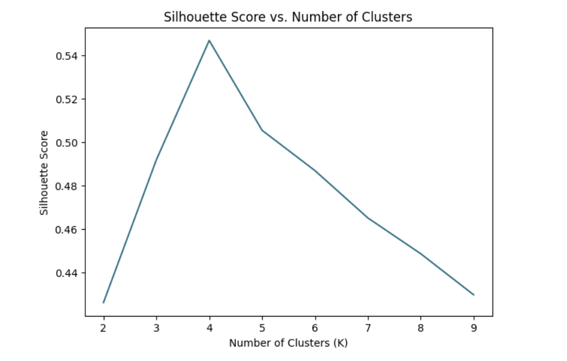
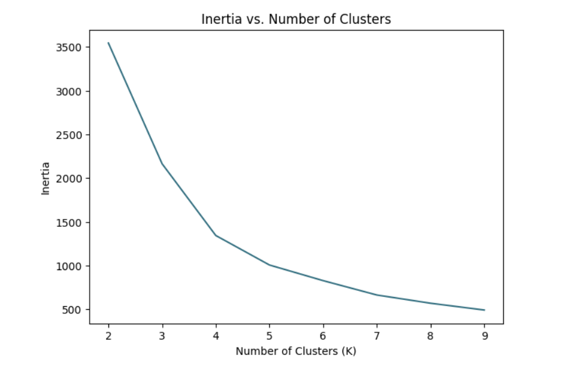
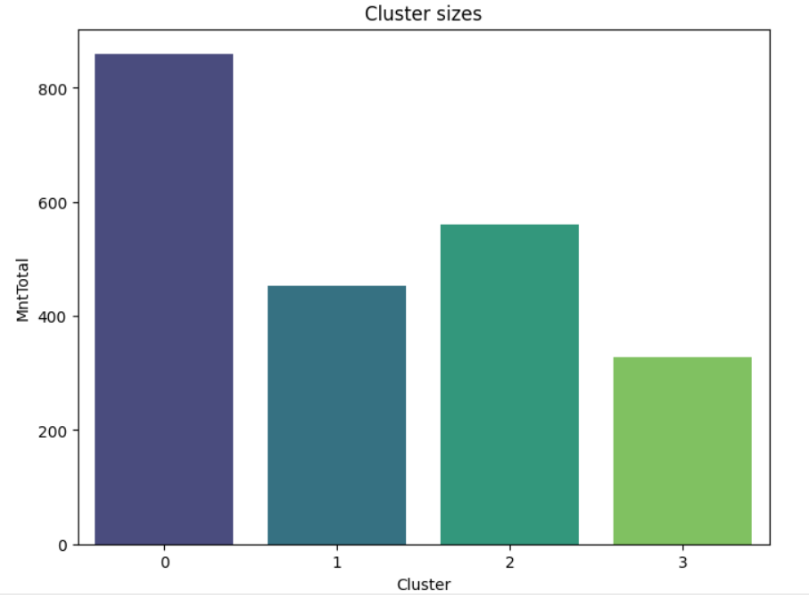
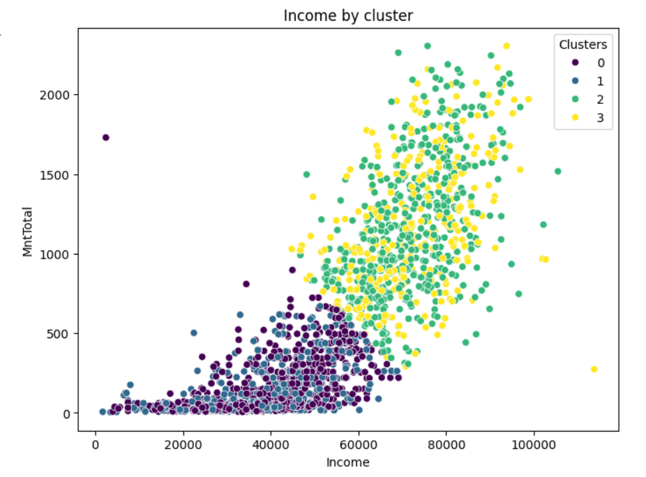

# OIBSIP
Projects during the internship in Oaisis Infobyte 

# Customer Segmentation Analysis for E-commerce

### Project Overview
This data analysis project aims to identify distinct customer segments for an e-commerce company by analyzing customer behavior and purchase patterns. The resulting segments enable targeted marketing, improved customer satisfaction, and strategic business enhancements.

### Dataset Information
- **Dataset**: Marketing Analytics - Customer Segmentation
- **Observations**: 2,205
- **Features**: 39, including demographic info, spending behavior, and campaign responses.

### Key Features
- **Campaign Acceptance**: `AcceptedCmp1`–`AcceptedCmp5`, `AcceptedCmpOverall`
- **Response**: Last campaign acceptance status
- **Complain**: Customer complaints over the past 2 years
- **Demographics**: `Education`, `Marital Status`, `Income`, `Age`
- **Spending**: `MntTotal` (total spending), plus breakdowns on products like `MntWines`, `MntMeatProducts`, etc.
- **Purchase Channels**: Web, store, catalog, and discount purchases

### Data Preparation
- **Cleaning**: Dropped columns with uniform values (`Z_CostContact`, `Z_Revenue`)
- **Outlier Removal**: Detected and removed outliers in `MntTotal` using IQR
- **Feature Engineering**: Created new features: `Marital` and `In_relationship` for simplified marital status analysis

### Exploratory Data Analysis (EDA)
1. **Spending Distribution**: Box plot for `MntTotal` and histogram for `Income` and `Age`
2. **Correlation Analysis**: Examined the relationship between `MntTotal` and key demographics using a heatmap
3. **Feature Relationships**: Bar charts by `Marital` and `In_relationship` for spending insights

### Clustering Analysis
- **Standardization**: Standardized `Income`, `MntTotal`, `In_relationship` for K-Means
- **Dimensionality Reduction**: Used PCA for visualizing customer spread
- **Cluster Selection**: Chose 4 clusters based on Elbow method and Silhouette score

### Customer Segments
1. **Cluster 0**: High-Value Customers in Relationships (26%)  
   - **Profile**: High income, in a relationship  
   - **Strategy**: Premium product promotions, family-focused ads

2. **Cluster 1**: Low-Value Single Customers (21%)  
   - **Profile**: Low income, single  
   - **Strategy**: Discounts, loyalty programs for frequent small purchases

3. **Cluster 2**: High-Value Single Customers (15%)  
   - **Profile**: High income, single  
   - **Strategy**: Lifestyle-oriented campaigns, special occasion promotions

4. **Cluster 3**: Low-Value Customers in Relationships (39%)  
   - **Profile**: Low income, in a relationship  
   - **Strategy**: Budget-friendly bundles, essential product discounts

### Visualizations

### Conclusion
The segmentation identifies 4 unique customer types, guiding targeted marketing to increase engagement, customer loyalty, and revenue. Future strategies include personalized campaigns, seasonal promotions, and feedback-driven adjustments to keep messaging relevant.

**Thank you!**

